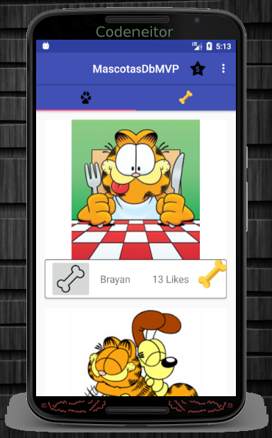
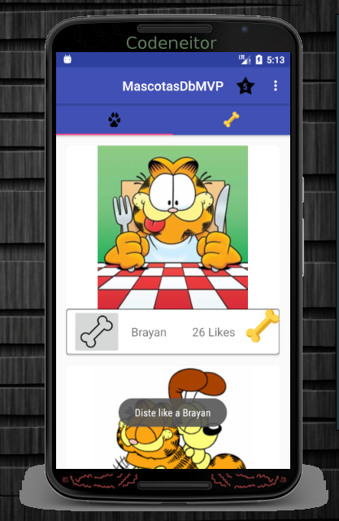

# MascotasDbMVP
En este proyecto se implementa el modelo vista presentador haciendo uso de SQLite para almacenar los datos.

# Trabajo realizado para la semana 5 del curso.

* [x] El proyecto corre.

* 

 

* [X] Existe un modelo de datos que visualizar.

 
* [X] El proyecto contiene el patrón MVP.

* [X] La aplicación crea una base de datos.

* [X] La aplicación está constltando la base de datos.

* [X] El proyecto esta guardando y mostrando correctamente las mascotas.

* [X] El número de Likes se almacena en la base de datos.
 
